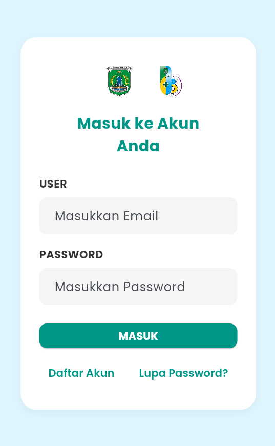
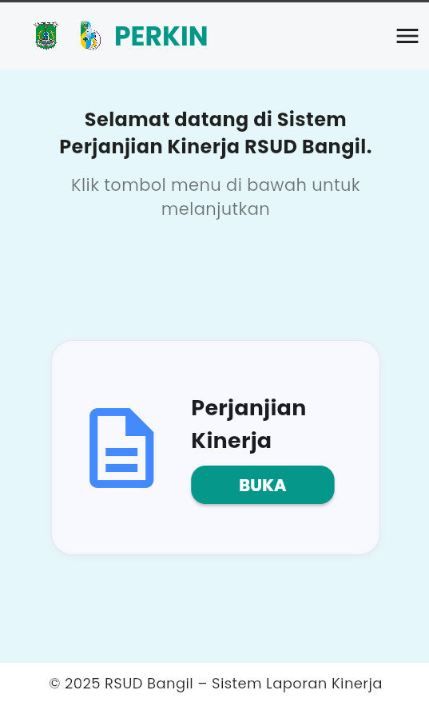
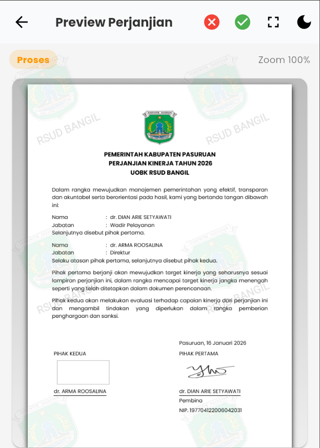

# RSUD Lapkin Mobile

### Aplikasi Perjanjian Kinerja Pegawai Berbasis Mobile

RSUD Lapkin Mobile merupakan aplikasi mobile yang dikembangkan untuk mendukung digitalisasi sistem perjanjian kinerja pegawai di RSUD Bangil. Aplikasi ini dibangun menggunakan Flutter sebagai framework pengembangan mobile dan Supabase sebagai backend service untuk autentikasi dan manajemen basis data.

Proyek ini dikembangkan dalam rangka kegiatan Merdeka Belajar Kampus Merdeka (MBKM) dan digunakan sebagai implementasi solusi digital terhadap proses administrasi perjanjian kinerja yang sebelumnya dilakukan secara manual dan semi-digital.

---

## 📌 Latar Belakang

Proses pengelolaan perjanjian kinerja pegawai sebelumnya dilakukan secara manual dan belum terintegrasi dalam satu sistem terpusat. Hal ini menyebabkan:

- Proses administrasi yang lambat
- Penggunaan dokumen fisik yang berlebihan
- Kesulitan monitoring oleh pimpinan
- Minimnya dokumentasi persetujuan secara sistematis

Aplikasi ini dikembangkan untuk mengatasi permasalahan tersebut melalui sistem mobile yang terintegrasi dan terdokumentasi secara real-time.

---

## 🚀 Fitur Utama

### 👤 Autentikasi Pengguna

- Login & Registrasi
- Reset Password
- Role-based Access (Pegawai & Pimpinan)

### 📝 Pengelolaan Perjanjian Kinerja

- Input perjanjian kinerja
- Edit dan pratinjau dokumen PDF
- Pengajuan perjanjian kinerja
- Monitoring status pengajuan

### ✅ Fitur Pimpinan

- Dashboard monitoring
- Review detail perjanjian
- Approve (Persetujuan)
- Reject (Penolakan) dengan catatan evaluasi

### 🔐 Keamanan Akun

- Perubahan email
- Perubahan kata sandi
- Validasi autentikasi berbasis Supabase

---

## 📸 Screenshot Aplikasi

### 🔐 Halaman Login

### 🏠 Dashboard Pegawai

### 📝 Form Perjanjian Kinerja

### ✅ Fitur Approve & Reject

---

## 🏗 Arsitektur Sistem

Aplikasi menggunakan arsitektur client-server:

Mobile App (Flutter)  
⬇  
Supabase Backend

- Authentication
- PostgreSQL Database
- Storage (Dokumen PDF)

Flutter bertindak sebagai client application, sementara Supabase menangani autentikasi pengguna, manajemen data, serta penyimpanan dokumen.

---

## 🛠 Teknologi yang Digunakan

- Flutter (Dart)
- Supabase
- PostgreSQL
- REST API Integration
- PDF Generator

---

## 📂 Struktur Project (Utama)

lib/
│
├── screens/ # Halaman UI aplikasi
├── widgets/ # Komponen reusable
├── services/ # Koneksi ke Supabase & logic API
├── models/ # Struktur data
└── main.dart # Entry point aplikasi

---

## 📱 Cara Menjalankan Project

### 1️⃣ Clone Repository

git clone https://github.com/Lxtream23/Rsud-Lapkin-Mobile.git

### 2️⃣ Masuk ke Folder Project

cd Rsud-Lapkin-Mobile

### 3️⃣ Install Dependencies

flutter pub get

### 4️⃣ Jalankan Aplikasi

flutter run

Pastikan Flutter SDK sudah terinstal dan perangkat/emulator sudah aktif.

---

## 🎯 Dampak Implementasi

Implementasi aplikasi ini memberikan beberapa dampak positif, antara lain:

- Meningkatkan efisiensi proses administrasi perjanjian kinerja
- Mengurangi penggunaan dokumen fisik
- Mempercepat proses persetujuan oleh pimpinan
- Meningkatkan transparansi dan dokumentasi evaluasi kinerja
- Mendukung transformasi digital di lingkungan RSUD Bangil

---

## 📖 Dokumentasi Tambahan

- Buku Panduan Penggunaan Aplikasi
- Laporan MBKM
- Capstone Project Documentation

([Link Manual Book](https://drive.google.com/file/d/1mqiKg-Bf_FvR2yVpb6JvXmTD3kll8jCt/view?usp=sharing))

---

## 👨‍💻 Developer

Nama: Lukman Hakim  
Program Studi: Teknik Informatika  
Program: Merdeka Belajar Kampus Merdeka (MBKM)  
Institusi Mitra: RSUD Bangil

---

## 📄 Lisensi

Proyek ini dikembangkan untuk keperluan akademik dan implementasi institusi.  
Penggunaan lebih lanjut dapat disesuaikan dengan kebijakan instansi terkait.
